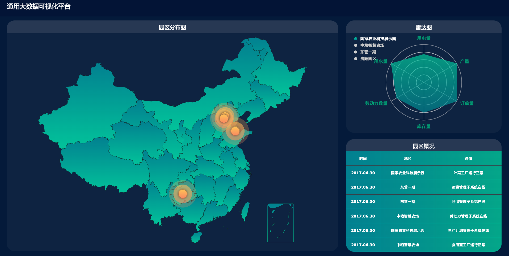
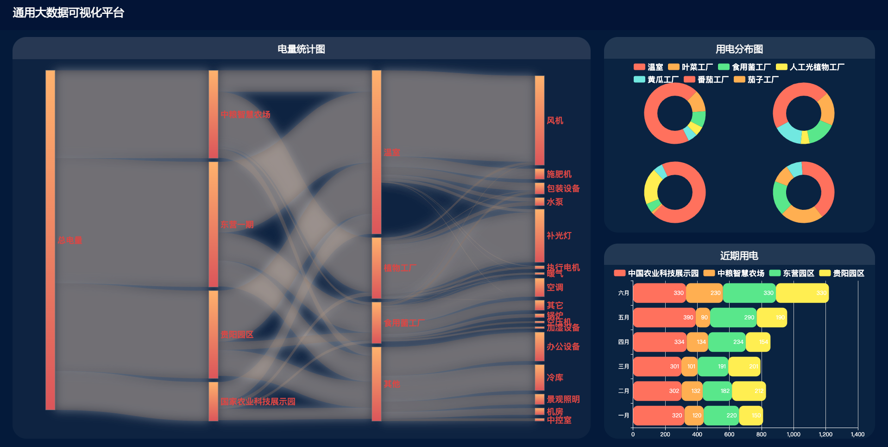
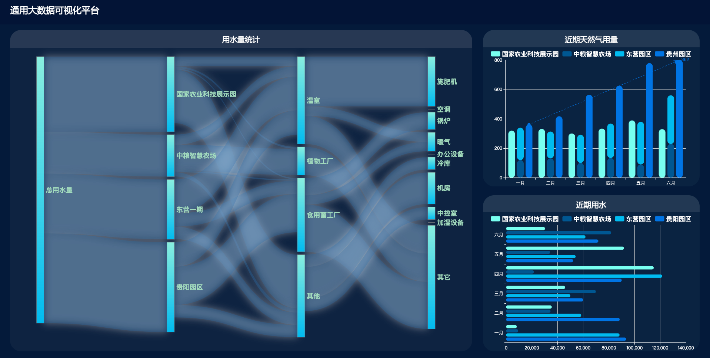
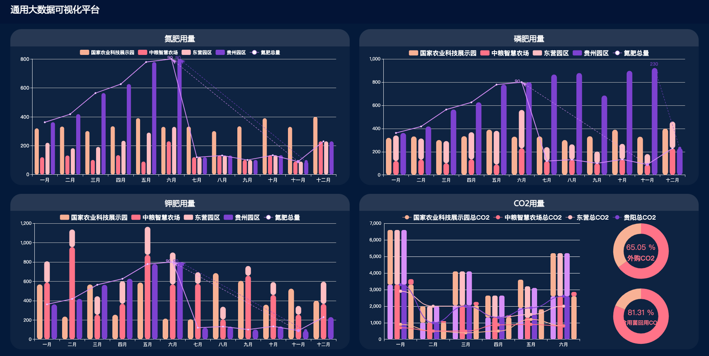
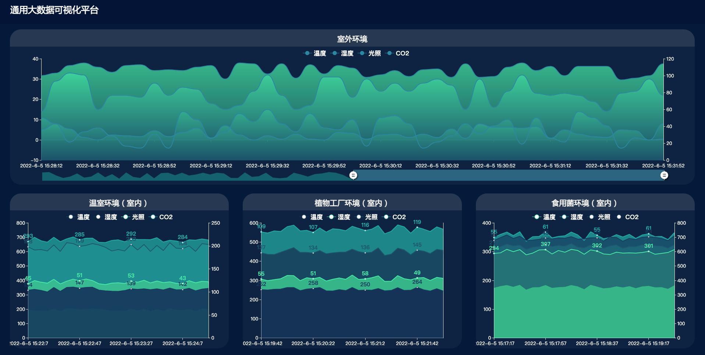
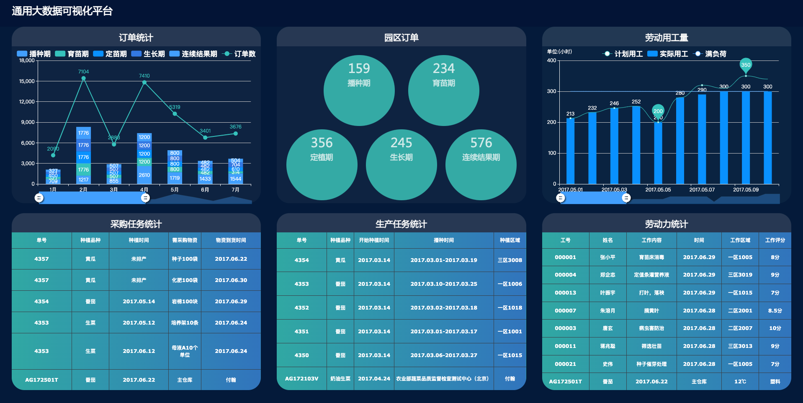
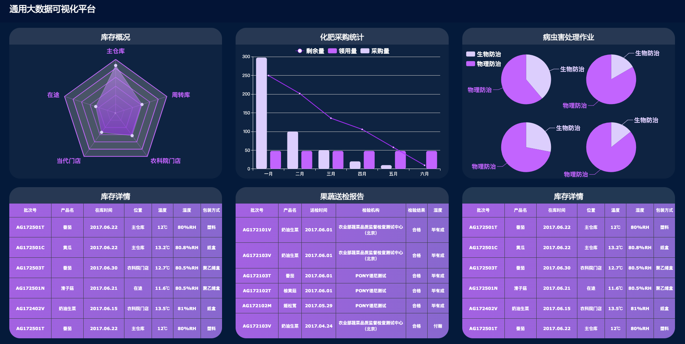

# data-visualization

A general solution for data visualization 一套数据可视化的通用解决方案

## 使用方式

```js
git clone https://github.com/MountainC44/data-visualization.git

npm install
```

## 截图










